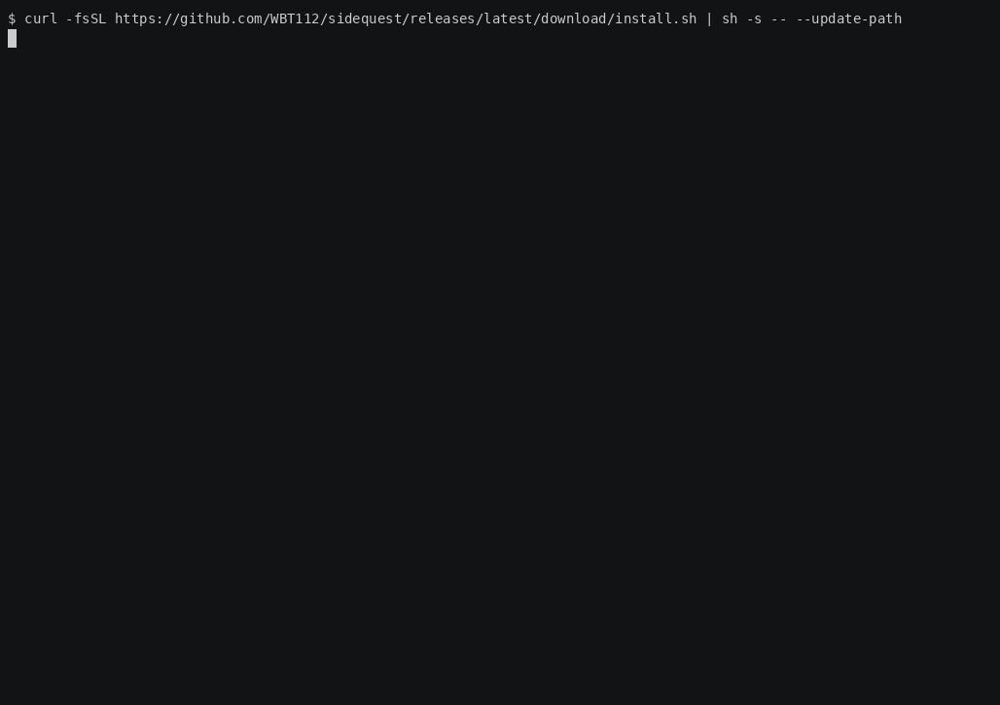

# sidequest

Ever wondered what to do while waiting for an ansible playbook to finish, a build to complete, or a long-running script to finish?
Ever tried to look busy while you just wait for Codex to do your stuff ?

Look no further!

Sidequest runs your command in one tmux pane and focuses a small Snake game in another.
The command stays visible, so you can follow what's happening while you play. Now with Boss-Key(F9).
You also get noticed when the command finishes. By default, command-pane output is stored for later review, so we could say you're doing some documentation along the way.



## Contents

- [Installation](#installation)
- [Quick Start](#quick-start)
- [Gameplay](#gameplay)

## Installation

Sidequest currently supports Linux `amd64` and `arm64`. Windows users should run Sidequest inside WSL 2.

Install the latest release:

```bash
curl -fsSL https://github.com/WBT112/sidequest/releases/latest/download/install.sh | sh -s -- --update-path
```

Open a new terminal after installation, then verify:

```bash
sidequest --version
```

Sidequest requires `tmux` at runtime (`sudo apt install tmux` or
`sudo dnf install tmux`). Release assets also include `.deb` and `.rpm`
packages for manual installation.

## Quick Start

```bash
sidequest -- ssh deploy@example.com
sidequest -- sh -c 'sudo du -xh /var /usr /home 2>/dev/null | sort -h'
sidequest --no-history -- ssh production.example.com
sidequest --mode quest -- make test
sidequest -- codex
sidequest -- claude "Run the test suite, fix any failures, and summarize the changes."
```

Try it with a harmless demo workload:

```bash
sidequest -- bash -c 'for i in {1..60}; do printf "working step %02d/60\n" "$i"; sleep 1; done'
```

## Gameplay

- `WASD` or arrow keys move Snake.
- `F9` hides or restores Sidequest while the command keeps running.
- `F12` switches between Snake and the command pane.
- Snake focus-pauses while the command pane is active and resumes when the game
  pane is active again, unless you paused manually.
- `F10` detaches back to your shell. If the command is still running, Sidequest
  prints the `sidequest attach <id>` command.
- `R` restarts Snake after a round over while the command keeps running.
- After the command finishes, `C` continues the current round and `Q` finalizes
  and quits.

Classic mode keeps Snake simple and adds Command Heat: the longer you actively
play, the faster Snake gets and the more food is worth. Time spent in the
command pane or on pause does not raise Heat. After the command has finished,
Heat stays frozen at the reached level while the round can continue.

Quest mode adds combo scoring, one mission per command, Golden Bytes, random
arena pickups and other stuff.

For complete controls and behavior details, use:

```bash
man sidequest
```

## Sessions and History

Runtime sessions:

```bash
sidequest list
sidequest attach <session-id>
```

Stored run history:

```bash
sidequest runs
sidequest show last
sidequest output last
sidequest purge <run-id>
```

By default, finished runs keep visible command-pane output under
`${XDG_STATE_HOME:-$HOME/.local/state}/sidequest/runs/`. Sidequest stores result
metadata and pane output, not the command or argument list. Terminal output may
still contain sensitive data.

For sensitive workloads, disable run history:

```bash
sidequest --no-history -- <command> [arguments...]
```

In no-history mode, Sidequest does not capture the command pane, does not write
an output file, and does not create stored run metadata. The live tmux pane
scrollback remains visible until the Sidequest session is closed.

Game statistics and separate Classic/Quest TOP 5 lists are stored locally in
`${XDG_STATE_HOME:-$HOME/.local/state}/sidequest/game-stats.json`.

## Development

Sidequest is built and released with Go `1.26.5`.

Run the normal local quality suite before committing:

```bash
./scripts/qa.sh
```

If Go is not available as `go` in `PATH`, point the script at the Go binary:

```bash
GO=/usr/local/go/bin/go ./scripts/qa.sh
```

Extended checks:

```bash
./scripts/qa.sh --race
./scripts/qa.sh --cover
./scripts/qa.sh --vuln
./scripts/qa.sh --race --cover
```

## Scope

Sidequest is meant for builds, upgrades, deployments and scripts that should stay
visible but do not need constant attention. It does not modify the wrapped
command, replace tmux, hide interactive prompts or act as a full terminal
emulator. Do not use this on production servers of course. I try to make Sidequest as safe as possible, but it is still a game and may have bugs. Use at your own risk.
